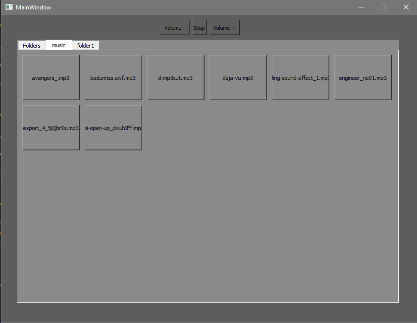

# Soundpanel DiscordBot

#How to run

    :python main.py

After main.py run we get running bot and Sound Panel
# Comands on discord

     !join adding bot to server 
     !play_song url_from_youtube download and play sound from youtube
     !stop stoping current playing song

#Sound Panel

Soundpanel look for mp3 files in music\ at directory of main.py
after pressing button that play sounds by discord bot

#Inprogress
1) Opening file aslo from Folders tab
2) Add search bar